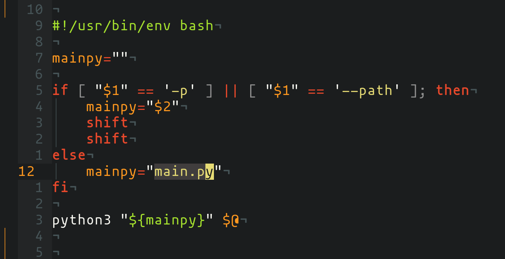

# Centralized Bookmarks

As a person, who hops from browser to browser and don't want to have account for every browser to sync consisting of browser at one place is a blessing.

Following project, helps us in creating/updating the centralized bookmark file(location: `~/.config/bookmarks.json`).


You can get video of demo [here](https://github.com/coolabhays)

<hr>


## Benefits:

* Bookmarks for all browsers at one place
* You can open any of the bookmark to any of the installed/provided browser
* You are provided with beautiful selection tools to select title of bookmark
* You can add bookmark to any of the browser you use and can update this bookmark file easily
* You can as well delete the bookmarks you don't want from this file
* It's easy to have backup of single file
* It's written is simple json format so manual updation/deletion isn't difficult at all, if done carefully
* Provided a wrapper shell script for easier use

<hr>


## Usage

Here's the help menu:

```
	usage: main.py [-h] [-s rofi|fzf|dmenu] [-d | -b Browser | -u]

	optional arguments:
	  -h, --help            show this help message and exit
	  -s rofi|fzf|dmenu, --selector rofi|fzf|dmenu
							use rofi, fzf or dmenu for selection
	  -d, --delete          delete bookmark
	  -b Browser, --browser Browser
							select browser
	  -u, --update          update bookmarks
```

You can use `main.py` directly if you want to do so. Although, I put a wrapper shell script so that you can put this script in your `PATH` and use it.

There's `-p` and `--path` flag in this wrapper script, which you can use to provide the path for `main.py` before providing any other flag/options for any further operation.

You can just as well open the script and change the `mainpy` variable(selected shown in image below) and update it with the path to `main.py`


